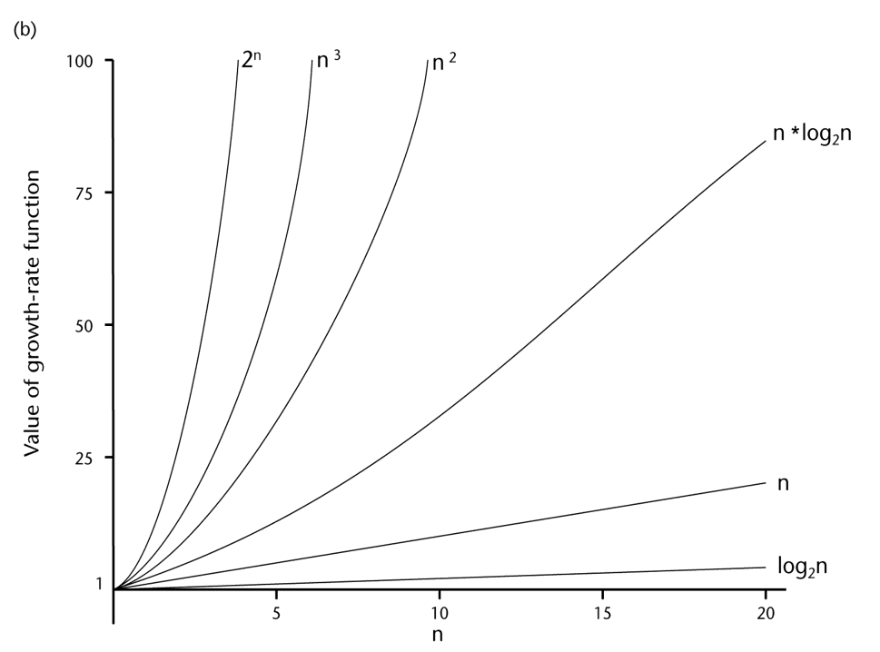

# Analysis and Development of Algorithms

*Dr. Petr Chunaev*

## Lecture 1 - Introduction. Design of algorithms. Complexity analysis of algorithms.

Useful references:

- Thomas H. Cormen, Charles E. Leiserson, Ronald L. Rivest; Clifford
  Stein. Introduction to Algorithms. 3rd edition. MIT Press, 2009.
- Ananiy Levitin. Introduction to the Design and Analysis of Algorithms.
  Addison Wesley, 2011.

### Development of algorithms

**Algorithm** - a sequence of clear instructions for solving a problem (for obtaining a required output for any acceptable input in a finite amount of time). Keypoints:

- The *class of inputs* for which an algorithm works has to be specified carefully.
- The same algorithm can be represented in *several different ways*.
- There may exist *several algorithms* for solving the same problem.
- Algorithms for the same problem can be *based on very different ideas* and
  can solve the problem with dramatically different speed.

Experiment:
$$
3x^2 + 7x - 10 = 0 \\
D = 49 + 120 = 169 \\
x = \frac{-7 \pm \sqrt{169}}{6}
$$
The experiment failed due to slow human computation.

Algorithm development:

1. understand the problem;
2. decide on: computational means, exact vs approximate solving, algorithm design technique;
3. design an algorithm;
4. prove correctness (recheck 2 and 3);
5. analyze the algorithm (recheck 2 and 3);
6. code the algorithm.

Algorithms should be analyzed without being tied to the parameters of a specific computer system.

Representations:

- natural language;
- pseudocode: a mixture of one of the natural languages (input / output, comments) and constructs specific to the programming language (for, if and while);
- flowcharts: drawings consisting of a sequence of geometric shapes connected by arrows, with the help of which each step of the algorithm execution is described (inconvenient for large algorithms);
- programming code.

Algorithm analysis criteria:

- time efficiency (running time function);
- space efficiency (the amount of RAM required);
- simplicity;
- generality;
- optimality.

### Analysis of algorithms. Design techniques. Data structures.

Important problem types:

- **Sorting:** to rearrange the items of a given list in some order (e.g. using a key).
- **Searching:** to find a given value, called a search key, in a given (multi)set.
- **String processing:** to process a string that is a sequence of characters from an
  alphabet.
- **Graph problems:** to analyze a graph, i.e. a collection of points called vertices,
  some of which are connected by line segments called edges, informally.
- **Combinatorial problems:** to find a combinatorial object - such as a permutation, a combination, or a subset - that satisfies certain constraints.
- **Geometric problems:** to explore object geometry.
- **Numerical problems:** to solve equations and systems of equations, compute
  definite integrals, evaluate functions, etc.

Algorithm performance: <u>time complexity</u>, space complexity. *Naive approach: run an algorithm on inputs of different size, analyze results manually.*

**Homework: recall how to analyze time complexity NOT in the worst case.**

Running time function $T(n)$ yields the time required to execute the algorithm of a problem of size $n$. We cannot define this function exactly.

Big O Notation (worst case):
$$
O(g(n)) = f(n) \quad\Leftrightarrow\quad \exists c, n_0>0: \quad 0\leq f(n) \leq cg(n), \quad n \geq n_0
$$
The goal of the algorithm designer: an algorithm with as low a growth rate of the running function, $T(n)$, of that algorithm as possible.

General rules for estimation:

- **loops:** running time of the statements in a loop times the number of iterations;
- **nested loops:** running time of the innermost loop times the product of the numbers of the operations;
- **consecutive statements:** add running time of those statements;
- **if/else:** never more than the running time of the slowest option.

**Data structure** - a particular scheme of organizing related data items.

## Lecture 2. Algorithms for unconstrained nonlinear optimization. Direct methods.

Literature:

- Bazara and Shetty. Nonlinear programming: Theory and algorithms
- Bazara, Jarvis and Sherali. Linear Programming and Network Flows
- Bonnans, Gilbert, Lemarechal, and Sagastizabal. Numerical Optimization.
  Theoretical and Practical Aspects
- Ben-Tal and Nemirovski. Lectures on Modern Convex Optimization: Analysis,
  Algorithms, and Engineering Applications
- Nocedal J., Wright Stephen J. Numerical Optimization

**Optimization methods** - the methods for finding optimal (in some sense) solutions for mathematical models. A mathematical model can be usually expressed via an **objective function** $f = f (x)$, where $x$ is generally a multidimensional vector, or via an optimality criterion (with constraints or without).

*To solve* the optimization problem $f(x) \to \min_{x\in Q}$ means to find the value of an argument, such as $f$ reaches the minimal value at $x^*$. Notation: $x^* = \arg\max_{x\in Q} f(x)$.

- Local and global optimization.
- Max-problem becomes min-problem if you consider $-f$.

Q, the region of acceptability, may be:

- Not defined (or reduced to be not defined) (**unconstrained optimization**).

- Defined via a system $S$ of linear or non-linear equations or inequalities (**constrained optimization**).

  $f$ or $S$ (non-)linear $\to$ (non-)linear programming / (non-)linear optimization

Methods for minimization:

- Direct (zero-order) methods - only values are used (wide class of functions, slow convergence).
- First-order methods (gradient methods) - values $f$ and $f'$ are used (relatively fast convergence, necessary to know the analytic expression of $f$ and $f'$).
- Second-order methods (Newtonian methods) - values $f$, $f'$ and $f''$ are used (fast convergence, necessary to know the analytic expression of $f$, $f'$ and $f''$).

### One-dimensional direct methods

Let $f(x): \quad [a, b] \in \mathbb{R}$. Approximately solve $f(x) \to \min_{x\in [a,b]}$ by finding $x^*$ with error $\varepsilon>0$.

**Exhaustive search:** take points
$$
x_k = a + k\frac{b-a}{n}, \quad k=0, \cdots, n \\
\frac{b-a}{n} \leq \varepsilon
$$
Calculate $f(x_k)$ and find the best of them. Really slow, ok for initial approximations.

**Dichotomy search:** let the function be convex. Calculate
$$
x_1 = \frac{a_0 + b_0 - \delta}{2} \quad x_2 = \frac{a_0 + b_0 + \delta}{2} \quad 0 < \delta < \varepsilon
$$
find $f(x_1)$ and $f(x_2)$. Reduce the interval:

- if $f(x_1) \leq f(x_2)$, then $a_1 = a_0$ and $b_1 = x_2$;
- $a_1 = x_1$ and $b_1 = b_0$, otherwise. 

We stop if $|a_k - b_k| < \varepsilon \quad (x^* \in [a_k, b_k])$.

**Golden section method:** same concept, different division to make less function calculations
$$
x_1 = a_0 + \frac{3-\sqrt{5}}{2} (b_0 - a_0) \quad x_2 = a_0 + \frac{\sqrt{5}-3}{2} (b_0 - a_0) \\
\left( \frac{x_1 + x_2}{2} = \frac{a_0 + b_0}{2} \right)
$$
Reduce:

- if $f(x_1) \leq f(x_2)$, then $a_1 = a_0$, $b_1 = x_2$ and $x_2 = x_1$;
- $a_1 = x_1$, $b_1 = b_0$ and $x_1 = x_2$, otherwise. 

### Multidimensional direct methods

**Exhaustive search:** we build a grid out of possible values of all input variables with certain steps, check all, get best.

**Gauss method (coordinate descent):** in each iteration we make all arguments except for one fixed. We find the minimum for the function of the first variable, set the current value of this variable to be constant. Then we do the same with the second. After we run out of variables, we repeat.

Problem: if level lines of the function $f(x_1, x_2)$ are close to $x_1 = x_2$, it gets slow (if $x_1 = x_2$, it gets stuck).

**Nelder-Mead method:** we use simplexes in $\mathbb{R}$. In our case ($n=2$), they are triangles. This is a [heuristic approach](https://optimization.mccormick.northwestern.edu/index.php/Heuristic_algorithms) which can find local minima or converge to a non-stationary point. Alg:

1. We take an arbitrary triangle, calculate $f()$ of those points.
2. We find the largest of those values, then reflect the triangle to the side opposite to the largest point (triangle is closer to the minimum).
3. Or we can make the triangle smaller without reflecting.

**Parameters:** reflection coefficient $\alpha > 0$ (usually $1$), shrinking coefficient $0 < \beta < 1$ (usually 0.5), expansion coefficient $\gamma > 1$ (usually 2).

**Algorithm:**

1. **Preparation.** Choose three points $x_i = (x^{(1)}_i, x^{(2)}_i)$, $i = 1, 2, 3$ for the initial simplex (triangle in our case). Calculate $f_1 = f(x_1)$, $f_2 = f(x_2)$, and $f_3 = f(x_3)$.

2. **Sorting.** Choose three points from the simplex vertices as follows: $x_h$ with the largest value of $f_h$, $x_g$ with the second-large value of $f_g$ and $x_l$ with the smallest value of $f_l$. The goal of the forthcoming manipulations is to decrease $f_h$ at least.

3. **Gravity centre.** Find the gravity centre for all point except $x_h$:
   $$
   x_c = \frac{1}{2}\sum_{i\neq h} x_i
   $$

4. **Reflection.** Reflect the point $x_h$ with respect to $x_c$ with the coefficient $\alpha$ (for $\alpha = 1$ it is the central symmetry): $x_r = (1 + \alpha) x_c - \alpha x_h$. Calculate $f_r = f(x_r)$.

5. **Expansion.** Check how the function values are decreased:

   - If $f_r < f_l$, then the direction is right and we can expand: calculate $x_e = (1 − \gamma)x_c + \gamma x_r$ and $f_e = f(x_e)$.

   - If $f_e < f_r$, the the simplex can be expanded: set $x_h := x_e$ and go to Step 7.

   - If $f_r < f_e$, then we moved too far: set $x_h := x_r$ and go to Step 7.

   - If $f_l < f_r < f_g$, then the choice of the new point is good (the new one is better than previous two): set $x_h := x_r$ and go to Step 7.

   - If $f_g < f_r < f_h$, then exchange $x_r$ with $x_h$ and $f_r$ with $f_h$. After this, go to Step 6.

   - If $f_h < f_r$, then go to Step 6.

     As a result, $f_l < f_g < f_h < f_r$.

6. **Shrinking.** Calculate $x_s = \beta x_h + (1 - \beta) x_c$ and $f_s = f(x_s)$.

   - If $f_s < f_h$, then set $x_h := x_s$ and go to Step 7.
   - If $f_s > f_h$, then the initial points are the best. Shrink the simplex globally as follows: $x_i := x_l + (x_i - x_l) / 2, \quad i \neq l$.

7. **Convergence check.** Check the mutual closeness of the simplex vertices (for example, by estimating the deviation of the vertices), i.e. the closeness to the minimum point.

   If the required precision is not achieved, go to Step 2.