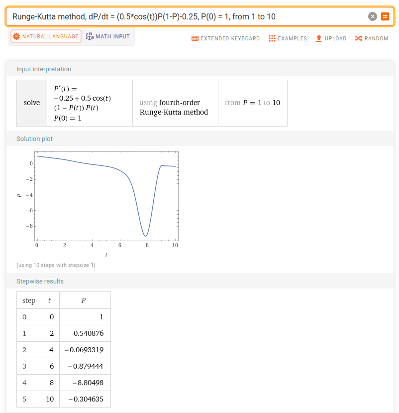
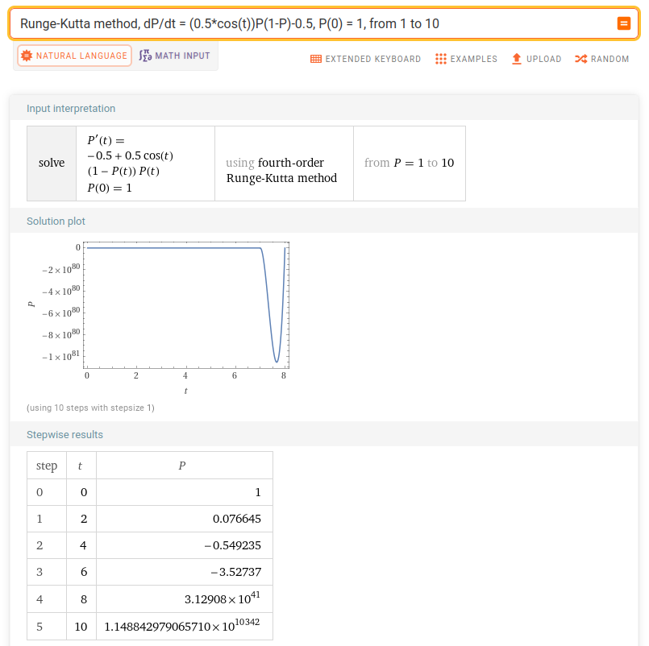
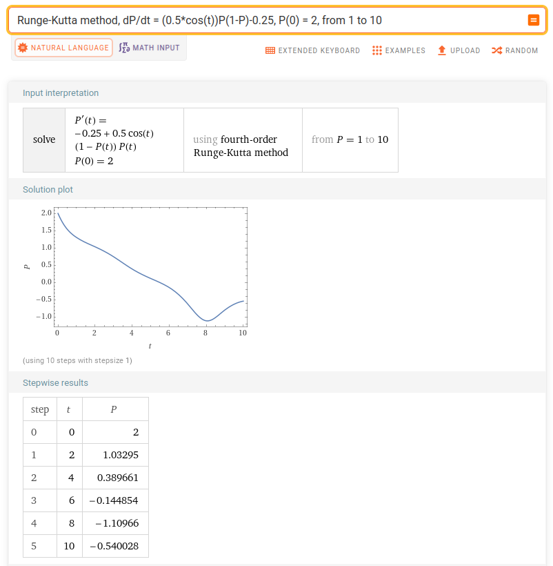
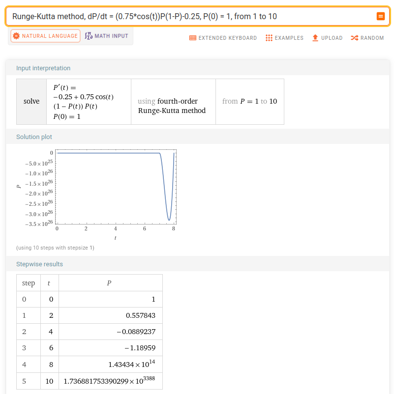

# Assignment 4
*Grigorev Mikhail, J4133c*

## Variation 1

$$
k = 0.5 \qquad h = 0.25 \qquad P_0 = 1
$$

## Variation 2

$$
k = 0.5 \qquad h = 0.5 \qquad P_0 = 1
$$

## Variation 3

$$
k = 0.5 \qquad h = 0.25 \qquad P_0 = 2
$$

## Variation 4

$$
k = 0.75 \qquad h = 0.25 \qquad P_0 = 1
$$

