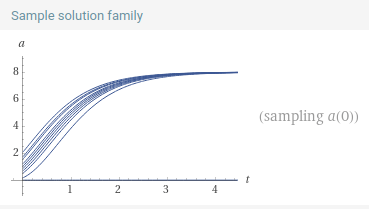
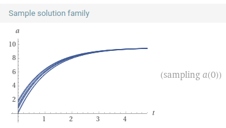
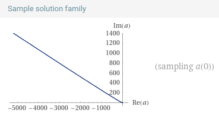
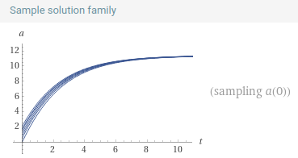
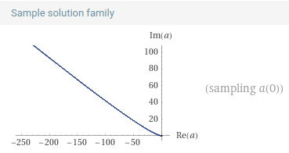

# Assignment 4bis
*Grigorev Mikhail, J4133c*

Here for visualization $k=0.5$ is used.

## Variation 1

$$
\frac{\mathrm{d}A}{\mathrm{d}t} = k \sqrt{A} \cdot (8-A)
$$

## Variation 2

$$
\frac{\mathrm{d}A}{\mathrm{d}t} = k \sqrt{A} + (8-A)
$$

## Variation 3

$$
\frac{\mathrm{d}A}{\mathrm{d}t} = k \sqrt{A} - (8-A)
$$

## Variation 4

$$
\frac{\mathrm{d}A}{\mathrm{d}t} = k (\sqrt{A} + (8-A))
$$

## Variation 5

$$
\frac{\mathrm{d}A}{\mathrm{d}t} = k (\sqrt{A} - (8-A))
$$

## Final answer

The correct version is the product (variation 1), because it yields solutions asymptotically monotonously growing up to 8.
$$
\frac{\mathrm{d}A}{\mathrm{d}t} = k \sqrt{A} \cdot (8-A) \\
\lim_{A\to 8}\frac{\mathrm{d}A}{\mathrm{d}t} = \lim_{A\to 8} \Big( k \sqrt{A} \cdot (8-A) \Big) = 0
$$
Thus the slope of the solutions decreases to $0$ when $A$ reaches $8$. This is quite intuitive.
